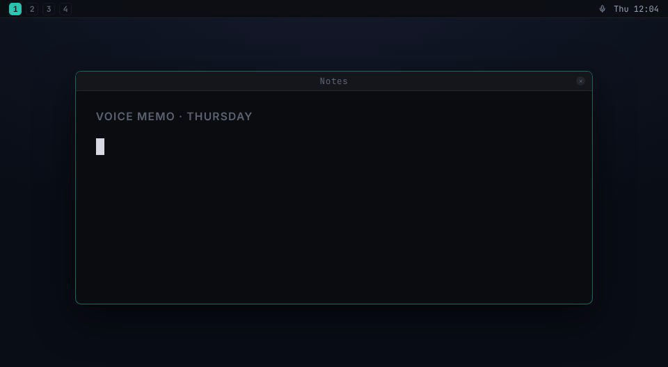

```
            _     _
 __      __| |__ (_)___  _ __ ___
 \ \ /\ / /| '_ \| / __|| '__/ __|
  \ V  V / | | | | \__ \| |  \__ \
   \_/\_/  |_| |_|_|___/|_|  |___/

  speak. type. done.
```

# whisrs

[](https://crates.io/crates/whisrs)
[](https://docs.rs/whisrs)

**Voice for the Linux desktop, written in Rust: dictation, read-aloud, and voice-driven LLM commands.**

Speech-to-text for Wayland, X11, Hyprland, Sway, Niri, GNOME, and KDE. Press a hotkey, speak, and your words appear at the cursor, in any app, any window manager, any desktop environment. Select text and whisrs reads it aloud (text-to-speech via Groq, OpenAI, Deepgram, or a local sidecar). Or say what you want and an LLM writes it at your cursor. Supports cloud transcription (Groq, Deepgram, OpenAI) and fully offline local transcription via whisper.cpp. Fast, private, open source.



---

## Why whisrs?

Dictation tools like Wispr Flow and Superwhisper are not available on Linux. whisrs fills that gap natively: a single Rust daemon with layout-aware keyboard injection (AltGr and dead keys included), per-compositor window tracking, and pluggable backends. What started as a dictation tool has grown into a voice layer for the whole desktop: speech in (dictation, voice commands), speech out (read any selection aloud), one hotkey each.

---

## Installation

### Quick install (Linux x86_64 / aarch64)

```bash
curl -sSL https://y0sif.github.io/whisrs/install.sh | bash
```

The install script downloads the latest prebuilt tarball, installs `whisrs`/`whisrsd` to `/usr/local/bin`, and runs interactive setup.

Pin a specific version with `WHISRS_VERSION=v0.1.10` or use the cloud-only minimal build with `WHISRS_MINIMAL=1`. Re-run the same command later to upgrade.

To **build from source** instead (including custom feature flag combos or unsupported architectures), use `cargo install whisrs --locked` or the `whisrs-git` AUR package.

After install, **press your hotkey** to start recording, **press again** to stop. Text appears at your cursor.

### GPU acceleration (local whisper.cpp)

Prebuilt tarballs run whisper.cpp on the CPU. Building with a GPU feature (`cargo install whisrs --features vulkan`, or `cuda` / `hipblas`) moves the model onto your GPU and cuts dictation latency from seconds to near-instant. It needs the toolkit's development packages, not just the GPU driver; see [docs/gpu-acceleration.md](docs/gpu-acceleration.md) for per-distro packages, how to verify the build, and the systemd pitfall when upgrading an existing install.

<details>
<summary><b>Other install methods (pre-built binary, AUR, Cargo, Nix, manual)</b></summary>

### Pre-built binary (manual)

The Quick install above already does this; this section is for users who want to install the tarball by hand.

Each tagged release publishes tarballs on [GitHub Releases](https://github.com/y0sif/whisrs/releases/latest) with both `whisrs` and `whisrsd` plus the contrib files (udev rule, systemd unit, man pages).

```bash
# Pick the artifact for your arch + variant:
ARCH=x86_64   # or aarch64
curl -sSL -o whisrs.tar.gz https://github.com/y0sif/whisrs/releases/latest/download/whisrs-linux-${ARCH}.tar.gz

# Or the minimal build (cloud backends only, no whisper.cpp; keeps tray + overlay):
# curl -sSL -o whisrs.tar.gz https://github.com/y0sif/whisrs/releases/latest/download/whisrs-linux-${ARCH}-minimal.tar.gz

tar xzf whisrs.tar.gz
sudo install -m755 whisrs whisrsd /usr/local/bin/
sudo install -m644 contrib/99-whisrs.rules /etc/udev/rules.d/
# On NixOS/Guix, point the rule's ACL fallback at your setfacl:
# command -v setfacl >/dev/null && sudo sed -i "s|/usr/bin/setfacl|$(command -v setfacl)|g" /etc/udev/rules.d/99-whisrs.rules
sudo udevadm control --reload-rules && sudo udevadm trigger
sudo usermod -aG input $USER   # log out / back in for the group change
whisrs setup
```

| Variant | Architectures | Includes local whisper.cpp |
|---|---|---|
| `whisrs-linux-{x86_64,aarch64}.tar.gz` | x86_64, aarch64 | yes (full build) |
| `whisrs-linux-{x86_64,aarch64}-minimal.tar.gz` | x86_64, aarch64 | no (cloud backends only) |

### Arch Linux (AUR)

```bash
yay -S whisrs-git
```

After install, run `whisrs setup` to configure your backend, API keys, permissions, and keybindings.

### Cargo

```bash
cargo install whisrs
```

Requires system dependencies: `alsa-lib`, `libxkbcommon`, `clang`, `cmake`.

After install, run `whisrs setup`.

### Nix

```bash
nix profile install github:y0sif/whisrs
```

Or add to your flake inputs:
```nix
inputs.whisrs.url = "github:y0sif/whisrs";
```

### Manual install

#### 1. Dependencies

```bash
# Arch Linux
sudo pacman -S base-devel alsa-lib libxkbcommon clang cmake

# Debian/Ubuntu
sudo apt install build-essential libasound2-dev libxkbcommon-dev libclang-dev cmake

# Fedora
sudo dnf install gcc-c++ alsa-lib-devel libxkbcommon-devel clang-devel cmake
```

#### 2. Build

```bash
git clone https://github.com/y0sif/whisrs
cd whisrs
cargo install --path .
```

#### 3. Setup

```bash
whisrs setup
```

The interactive setup will walk you through backend selection, API keys / model download, microphone test, uinput permissions, the user service, and keybindings.

Setup detects your init system and installs the matching service: a systemd user unit from `contrib/whisrs.service`, or an OpenRC user service from `contrib/openrc/`. To install by hand instead:

<details>
<summary>systemd</summary>

```bash
install -Dm644 contrib/whisrs.service ~/.config/systemd/user/whisrs.service
systemctl --user enable --now whisrs.service
```
</details>

<details>
<summary>OpenRC (user mode, OpenRC >= 0.55)</summary>

```bash
install -Dm755 contrib/openrc/whisrs.initd ~/.config/rc/init.d/whisrs
install -Dm644 contrib/openrc/whisrs.confd ~/.config/rc/conf.d/whisrs
rc-update --user add whisrs default
rc-service --user whisrs start
```

Tunables live in `~/.config/rc/conf.d/whisrs`. Logs go to `~/.local/state/whisrs/whisrsd.log` rather than a journal.
</details>

#### 4. Bind a hotkey

Example for Hyprland (`~/.config/hypr/hyprland.conf`):
```
bind = $mainMod, W, exec, whisrs toggle
```

Example for Sway (`~/.config/sway/config`):
```
bindsym $mod+w exec whisrs toggle
```

</details>

---

## Transcription Backends

| Backend | Type | Streaming | Cost | Best for |
|---|---|---|---|---|
| **Groq** | Cloud | Batch | Free tier available | Getting started, budget use |
| **Deepgram Streaming** | Cloud (WebSocket) | True streaming | $200 free credit | Streaming with free credits |
| **Deepgram REST** | Cloud | Batch | $200 free credit | Simple, 60+ languages |
| **OpenAI Realtime** | Cloud (WebSocket) | True streaming | Paid | Best UX, text as you speak |
| **OpenAI REST** | Cloud | Batch | Paid | Simple fallback |
| **OpenAI-compatible Realtime** | External WebSocket | Completed-utterance realtime | Free / self-hosted | Lemonade and similar OpenAI-style ASR servers |
| **Local whisper.cpp** | Local (CPU/GPU) | Silence-split phrases | Free | Privacy, offline use |
| **ASR sidecar** | Local sidecar or any OpenAI-compatible endpoint | Batch | Free | Bring-your-own ASR (Moonshine, Parakeet, VibeVoice-ASR, LiteLLM, Speaches, …) |

Groq is the default. For fully offline use, run `whisrs setup` and select **Local > whisper.cpp**: `base.en` (142 MB, ~388 MB RAM) is recommended; `tiny.en` (75 MB) for low-end hardware, `small.en` (466 MB) for higher accuracy.

Local whisper.cpp streams by splitting dictation into phrases at natural pauses and decoding each phrase exactly once; for local models without a Rust runtime (Moonshine, NVIDIA Parakeet, VibeVoice-ASR) the ASR sidecar backend talks to a small local HTTP service (ready-to-run recipes in [`contrib/asr-sidecars/`](contrib/asr-sidecars/)), and its OpenAI `/v1/audio/transcriptions` wire format also drives any OpenAI-compatible endpoint (LiteLLM, Speaches, your own server). External realtime servers that speak the OpenAI Realtime event model over WebSocket (Lemonade is the first supported profile) use `backend = "openai-compatible-realtime"`. Details for all three: [docs/configuration.md](docs/configuration.md).

---

## Configuration

Config file: `~/.config/whisrs/config.toml`; `whisrs setup` writes a working file. A minimal example:

```toml
[general]
backend = "groq"   # groq | deepgram-streaming | deepgram | openai-realtime | openai | openai-compatible-realtime | local-whisper | asr-sidecar
language = "en"    # ISO 639-1 or "auto"
overlay = false    # bottom-screen recording overlay

[groq]
api_key = "gsk_..."
```

Env-var overrides: `WHISRS_GROQ_API_KEY`, `WHISRS_DEEPGRAM_API_KEY`, `WHISRS_OPENAI_API_KEY`, `WHISRS_ASR_SIDECAR_API_KEY`.

For the full reference (overlay, `[input]`, `[tts]`, `[llm]`, `[hotkeys]`, `[hooks]`, backend sections, GNOME extension setup), see [docs/configuration.md](docs/configuration.md).

---

## CLI Commands

```
whisrs setup     # Interactive onboarding
whisrs config    # Interactive editor for ~/.config/whisrs/config.toml
whisrs toggle    # Start/stop recording (uses general.language)
whisrs toggle -l en  # Start/stop recording, overriding the language for this session
whisrs cancel    # Cancel recording, discard audio
whisrs status    # Query daemon state
whisrs restart   # Restart the daemon (uses the systemd or OpenRC user service when present)
whisrs command   # Command mode: select text + speak instruction → LLM rewrite
whisrs llm-command <name>      # Toggle a named [[llm_commands]] entry (see config.toml)
whisrs llm-command-set <name>  # Reprogram a named LLM command from the current selection
whisrs speak     # Read the selected text aloud (alias: whisrs read; press again to stop)
whisrs log       # Show recent transcription history
whisrs log -n 5  # Show last 5 entries
whisrs log --clear  # Clear all history
```

### Per-language keys

`toggle` accepts `--language`/`-l <CODE>` (ISO 639-1, or `auto`) to override `general.language` for that one session, with no config edit or daemon restart. Bind a separate key per language to dictate in each without switching settings:

```
bind = , F1, exec, whisrs toggle -l en   # Hyprland
bind = , F2, exec, whisrs toggle -l pl
```

### Voice + LLM

Three ways to put an LLM between your voice and the cursor, all sharing the one `[llm]` section (any OpenAI-compatible `/chat/completions` endpoint works, including a local LM Studio / Ollama / llama.cpp server):

- **`whisrs command`**: select text, speak an instruction ("make this formal"), and the selection is rewritten in place.
- **`[[llm_commands]]`**: a named instruction on its own hotkey. Dictate, the LLM applies it, the result is typed. A generic entry turns speech into artifacts: say "the command to install steam on arch" and `sudo pacman -S steam` lands at your cursor.
- **`[general] llm_post_process`**: the same rewrite applied to every dictation on the normal toggle key, no extra binding.

`llm_post_process` works with **batch backends only** (`deepgram`, `groq`, `openai`, `asr-sidecar`). Streaming backends (including `local-whisper`) type text as it arrives, so no whole transcript ever exists to post-process and the flag is a silent no-op; `whisrsd` warns at startup if you pair them. Use an `[[llm_commands]]` hotkey instead, which works whatever the backend.

If the LLM call fails, times out, or returns nothing, the raw transcript is typed instead, so a dictation is never lost to post-processing. Post-processed entries show up in `whisrs log` tagged `<backend>+llm`. Full reference: [docs/configuration.md](docs/configuration.md).

---

## Supported Environments

| Component | Support |
|---|---|
| **Hyprland** | Tested by maintainer and community (Arch Linux) |
| **Sway / i3** | Implemented; additional reports welcome |
| **Niri** | Implemented; tested by contributor on Niri 26.04 (CachyOS) |
| **X11 (any WM)** | Tested by community on Ubuntu 24.04 (Xorg) |
| **GNOME Wayland** | Tested by community on Ubuntu 24.04 and Arch (mutter); overlay via the bundled [GNOME Shell extension](contrib/gnome-shell-extension/README.md) |
| **KDE Wayland** | Implemented via D-Bus; reports welcome |
| **Audio** | PipeWire, PulseAudio, ALSA (auto-detected via cpal) |
| **Distros** | Confirmed on Arch Linux and Ubuntu 24.04; any Linux with the system dependencies above |

> **Note:** whisrs is daily-driven on Hyprland (Arch Linux), with community confirmation on GNOME Wayland (Ubuntu 24.04 + Arch), Xorg (Ubuntu 24.04), and Niri (CachyOS). Sway, i3, and KDE reports are still wanted; if you use whisrs there, please open an issue with what works and what doesn't.

---

## Project Status

whisrs is functional and daily-driven. Streaming transcription, command mode, read-selection-aloud (TTS via Groq, OpenAI, Deepgram, or a local sidecar), LLM post-processing and named voice commands, multi-language support, system tray, OSD overlay, layout-aware injection (incl. AltGr + dead keys), the generic ASR sidecar backend, and packaging for AUR / Nix / crates.io all ship today. Native local Vosk and Parakeet backends are next.

Per-release details: [docs/version-roadmap.md](docs/version-roadmap.md).

---

## Troubleshooting

See [docs/troubleshooting.md](docs/troubleshooting.md) for the full list. The two issues that come up most:

- **Garbled output / wrong characters on non-US layouts**: whisrs auto-detects your XKB layout (compositor → `setxkbmap` → `localectl` → env vars) and falls back to US/QWERTY when all of those fail. [How to fix the detection](docs/troubleshooting.md#garbled-output--wrong-characters-on-non-us-layouts).
- **Hotkeys fire on physical key positions, not layout characters**: intentional; the listener reads raw evdev events before any XKB translation, like every evdev-based hotkey tool. On non-US layouts, pick triggers by their QWERTY position. [Details](docs/troubleshooting.md#hotkey-keys-are-physical-positions-not-layout-characters).

---

## Contributing

The biggest way to help right now:

1. **Test on your compositor**: Sway, i3, KDE, GNOME. Report what works and what doesn't.
2. **Test on your distro**: Ubuntu, Fedora, NixOS, etc. Build issues, missing deps, etc.
3. **Bug reports**: if text goes to the wrong window, characters get dropped, or audio doesn't capture, open an issue.

See [CONTRIBUTING.md](CONTRIBUTING.md) for development setup and project structure.

---

## [How whisrs Compares](docs/comparison.md)

## [FAQ](docs/faq.md)

---

## License

MIT
